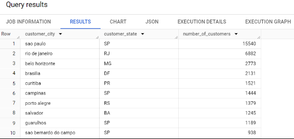

# Business Case of E-Commerce

## Disclaimer

This analysis is based on the data provided and reflects the state of the dataset as of the time of the analysis. The insights and recommendations are derived solely from my point of view and the dataset in question and do not necessarily represent the broader operations or circumstances of the company. The analysis assumes the accuracy of the data as received and has not been independently verified. Future analyses may yield different insights as new data becomes available or as business conditions change.

## Note on Results

Due to the large volume of results generated by this analysis, only a subset has been presented here to illustrate the key trends and patterns. Specifically, the top 10 to 15 results have been included as screenshots to provide a snapshot of the most relevant findings. For a complete view of the data and to explore additional insights, please refer to the full dataset.

---

## Q1.1: Data Type of All Columns in the "customers" Table

### Query

```sql
SELECT column_name, data_type
FROM `ecom.INFORMATION_SCHEMA.COLUMNS`
WHERE table_name = 'customers'
```

## Screenshot


## Insights
- The query reveals the data structure of the customers table, highlighting that it comprises columns with data types of both String and Int64. Understanding the data types is crucial for data integrity and query optimization. For instance, knowing that customer_id is an Int64 assures us it can handle large numeric values efficiently, while customer_name being a String indicates it's designed to store textual data, which is essential for personalization and identification.

## Recommendations
- Data Type Consistency: Ensure consistency in the data types used across the database to prevent type mismatch errors. For instance, if customer_id references another table, both should be of type Int64.
- Query Optimization: Use the knowledge of data types to optimize queries. Knowing a column is an Int64 allows for numerical operations and optimizations, while String operations might require different indexing strategies.
- Data Validation: Implement robust data validation rules, especially for String fields, to maintain data quality. For example, setting maximum lengths on String fields can help avoid data truncation errors.

---

## Q1.2: Get the Time Range Between Which the Orders Were Placed

### Query

```sql
SELECT MIN(order_purchase_timestamp) AS earliest_order_time, MAX(order_purchase_timestamp) AS latest_order_time
FROM `ecom.orders`
```
## Screenshot


## Insights
- This query identifies the time range within which all orders in the dataset were placed, from the earliest to the latest. Specifically, the orders span from 2016-09-04 21:15:19 UTC to 2018-10-17 17:30:18 UTC. This time frame is critical for understanding the period under analysis, allowing for temporal insights into customer behavior, order volume trends, and seasonal impacts on sales.

## Recommendations
- Temporal Analysis for Business Insights: Use this time range to conduct further temporal analyses, such as identifying peak sales periods, understanding seasonal variations in order volume, and correlating sales data with marketing campaigns or major events within the same timeframe.
- Data Completeness Verification: Verify that the data set completeness aligns with this time range. If there are missing dates or discrepancies, it might indicate data integrity issues or gaps in the data collection process.
- Strategic Planning and Forecasting: Leverage the identified time range for strategic planning, including stock management, marketing campaigns, and resource allocation. Understanding the timeline can help predict future trends based on past patterns.

---

## Q1.3: Count the Cities & States of Customers Who Ordered During the Given Period

### Query

```sql
SELECT 
  c.customer_city, 
  c.customer_state, 
  COUNT(DISTINCT c.customer_id) AS number_of_customers
FROM `ecom.customers` AS c
JOIN `ecom.orders` AS o ON c.customer_id = o.customer_id
GROUP BY c.customer_city, c.customer_state
ORDER BY number_of_customers DESC
```

## Screenshot



## Insights
- This query provides a geographical breakdown of the customer base, revealing significant concentrations in specific cities and states. The data indicates that customers from "Sao Paulo" city, in "Sao Paulo" state, have the highest number of orders, significantly outpacing other regions. This suggests a strong market presence in Sao Paulo, potentially due to its large population and economic status. The disparity between "Sao Paulo" and other cities like "Rio de Janeiro" underscores varying market penetrations across different regions.

## Recommendations
- Market Focus: Given the high concentration of customers in "Sao Paulo", it may be beneficial to focus marketing and sales efforts in this area to further capitalize on the existing customer base. This could include localized advertising campaigns, opening new stores, or enhancing delivery logistics for faster service.
- Expansion Opportunities: While "Sao Paulo" shows strong sales, there's potential for growth in other cities and states with fewer customers. Identifying reasons for lower penetration in these areas—be it lack of awareness, preference for competitors, or logistical challenges—can guide strategic expansions.
- Localized Offerings: Tailor product offerings and marketing messages to the specific preferences and needs of customers in top cities and states. For regions with emerging customer bases, conduct market research to understand local preferences and customize offerings accordingly.
- Infrastructure Investments: For areas with significant customer activity, consider investing in infrastructure, such as warehouses or distribution centers, to improve delivery times and reduce shipping costs.
---

## 2.1.Is there a growing trend in the no. of orders placed over the past years?

## Query

```sql
SELECT 

`  `EXTRACT(YEAR FROM order\_purchase\_timestamp) AS order\_year,

`  `COUNT(order\_id) AS total\_orders

FROM `ecom.orders`

GROUP BY order\_year

ORDER BY order\_year

## Screenshot


```

## Insights

From this above image we can understand that the number of order placed over past years is increased.

- The reason of low total orders in 2016 is because the data is available only for September and October month. This might be less data acquired.

- The results indicate a substantial growth in the number of orders placed over the past years:

- In 2016, there were 329 orders, which can be considered a starting or pilot phase.

- In 2017, the number of orders increased dramatically to 45,101. This represents an increase of more than 100 times the previous year, signaling a significant uptake in the company's market presence or consumer adoption of the service.

- In 2018, the growth continued, with the total orders reaching 54,011. This is an increase of approximately 20% from 2017.


## Recommendations

- Investigate Underlying Factors: Analyze the factors contributing to this growth. This could include marketing campaigns, expansion into new markets, improvements to the online platform, or broader economic factors.

- Sustain Growth: Identify the successful strategies that have driven this growth and consider how to sustain or enhance them. This might include scaling up marketing, improving logistics and supply chain management, or expanding product ranges.

- Infrastructure Scalability: Ensure that the company's infrastructure, both technical and logistical, can handle further increases in order volume. It's essential to scale operations to avoid potential bottlenecks as the company grows.

- Customer Experience Focus: With the increase in order volume, maintain a focus on customer service quality. Growth should not come at the expense of customer satisfaction.


